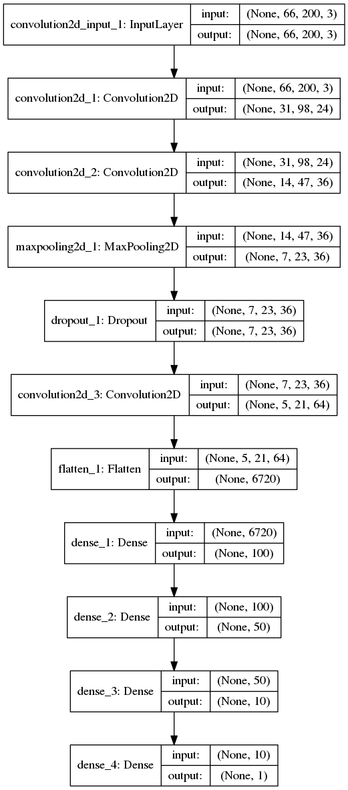
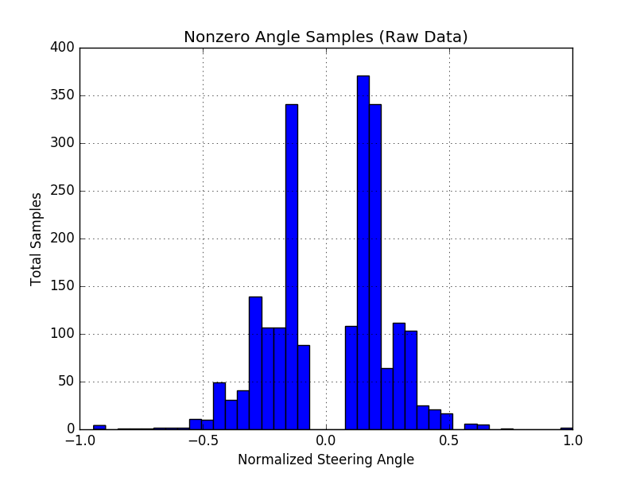
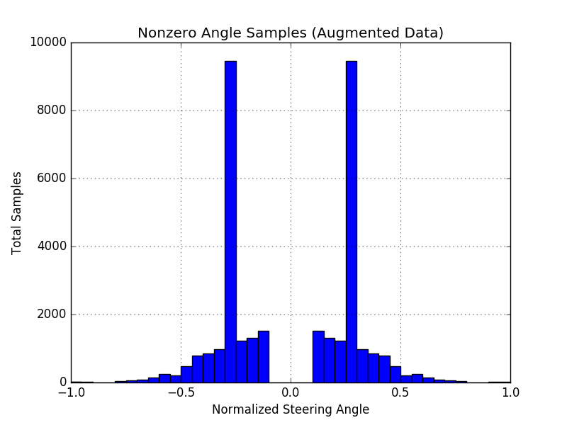
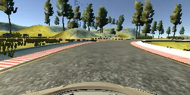
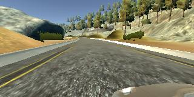
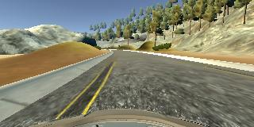
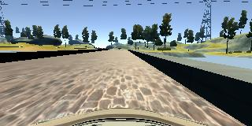
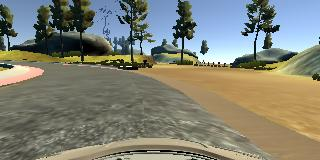

# CarND-Behavioral-Cloning-Project

My work for Udacity's Self-Driving Car Nanodegree, Project 3

## File Overview

* model.py - The main file for training. Most of the work is in fetching, preprocessing, and augmenting training data.
* generate_model.py - File used for generating the model itself. When run as a script, generate model.json.
* bc_utils.py - A file for constants shared among model.py and generate_model.py.

## Model Architecture

My model is heavily based off of Nvidia's [End to End Learning for Self-Driving Cars](http://images.nvidia.com/content/tegra/automotive/images/2016/solutions/pdf/end-to-end-dl-using-px.pdf) paper. I made the following adjustments experimentally:

* Dropping the 3rd and 4th convolutional layers and replacing them with a pooling layer and a dropout layer. The dropout layer is meant to introduce a nonlinearlity.
* Adding l2 weight regularization and maxnorm weight constraints to the fully connected layers. The maxnorm constraints were added to cap exponential instabilities I noticed occur during training.
* Adding relu actiation to the first two fully connected layers. Relu activation was added to introduce nonlinearities.

I used an adam optimizer during training with the goal of minimizing mean squared error between predicted and correct steering angles.

### Full Model Description

* Convolutional layer - 5x5 kernel with 24 depth, and a stride of 2.
* Convolutional layer - 5x5 kernel with 36 depth, and a stride of 2.
* Max pooling layer - 2x2 kernel and a stride of 2 (Keras defaults).
* Dropout layer - 0.5 probability
* Convolutional layer - 3x3 kernel with 64 depth.
* Flatten layer
* Fully connected layer - size 100, relu activation.
* Fully connected layer - size 50, relu activation.
* Fully connected layer - size 10
* Fully connected layer - output layer, with only 1 entry.

All fully connected layers use l2 regularization with a 0.01 weight penalty and 4 maxnorm constraint.

A diagram of the model architecture autogenerated by Keras is shown below.

## Training Data

I used Udacity's own driving data set for the bulk of training since I got poor results using my own data via keyboard steering.

I augment all data the following ways:

* Side camera steering data is shifted by an experimentally-determined angle to force the car to steer away from walls.
* All images used are mirrors and their steering angles reversed, which doubles the effective data set.
* Noise is added to the steering angles to help prevent the model from getting stuck in turns or going straight.

I preferentially train the model on data that requires steering rather than straight driving to make it more likely to turn. Data with a zero (or close to zero) angle is included according to an experimentally-determined ratio, which turned out to be very low.

I generated the following extra data sets:

* Left wall data: Data of the car driving straight while close to the left wall.
* Right wall data: Data of the car driving straight while close to the right wall.
* Dirt road data: Data of the car driving around the curve where the road first forks off between the main road and dirt road.

For these extra training sets, I used an experimentally-determined angle that forces the car away from the walls rather than using the actual steering angle data recorded.

### Training Image Statistics

Training data taken from the Udacity dataset was heavily weighted towards nonzero steering angles, where "nonzero" means magnitude >= 0.1. The ratio of nonzero to zero steering angles taken was 20:1.

After augmenting this data by mirroring and adding angle adjustments for the left and right cameras, I had significantly more nonzero samples to work with:

Some notable highlights of the augmented data:

* Note the two large peaks. These peaks are a result of adding 0.28 to all angles to compensate the left and right cameras. Since most data was zero, this adds many values to an otherwise fairly smooth distribution.
* Note the symmetry of the data. This is a direct result of doubling the amount of data available by reflecting all images.
* Note the bumps at the extrema. These occur because I cap adjusted the adjusted angles at 1 (the maximum possible steering angle magnitude), so any angles that would have otherwise overflown the bounds accumulate instead.

### Sample Training Images

Below are some representative samples of the raw input images from the datasets used.

Udacity Dataset - Center Camera

Udacity Dataset - Left Camera

Udacity Dataset - Right Camera

Custom Data - Hugging Left Wall

Custom Data - Hugging Right Wall

Custom Dataset - Hugging Dirt Road

## Image Preprocessing

My image processing pipeline consists of:

* Loading in data given a file path
* Resizing the image, to make training faster and reduce memory requirements
* Cropping the top and bottom of the image, so the sky and the hood of the car do not influence the model.
* Converting the image to YUV color space, as is done in the Nvidia paper. I found that this step made a big difference in the quality of my model.
* Normalizing image data values around 0.

## Training

I trained my model over 5 epochs with 3000 samples per epoch. 5 epochs was chosen because model accuracy did not improve significantly after that. 3000 samples was chosen based on the amount of training data available and for allowing me to train the model in a reasonable time (about 3 minutes). I training my model on a GPU-enabled AWS EC2 instance.

500 samples were used for each validation cycle and for testing. Given the number of samples available, the use of augmented data, and the use of a generator that loops through all samples, there was enough data to ensure there wasn't overlap between the training, validation, and testing samples fed to the model.

A generator was used to load image data. Additionally, the data were shuffled before being fed to the model to reduce any dependency on training order that might be introduced.

## Discussion

Using the Nvidia model as a base, I found that augmentation of my training data yielded larger improvements than modifying the model. However, after first getting decent results on Udacity's data, I did find that the model performed better after adding max pooling and dropout.

Two of the biggest factors in model accuracy turned out to be the ratio of straight to angled steering images used and the angle adjustment magnitude for the side cameras. Experimentally tuning these parameters got my model very close to working well.

A few of the main problem areas during training were:

* The first turn; the car often took a hard turn into the water upon reaching the turn.
* The bridge; the car often drifted into the wall of the bridge or even took a hard turn into the wall as soon as it got to the bridge.
* The fork where the dirt road begins; after successfully training my model to get past the first turn and bridge, it would often crash into the center of the fork.

To give the model extra help in steering away from these obstacles, I generated extra data with hardcoded adjustments designed to strongly influence the weights.

## Aspects That Could Be Improved

Currently, the fork in the road is still the most difficult part, although the model is able to clear it without bumping up onto the barrier. Additionally, there are times when the car oscillates between the two sides of the road, particularly on long straight stretches or after a hard turn.
